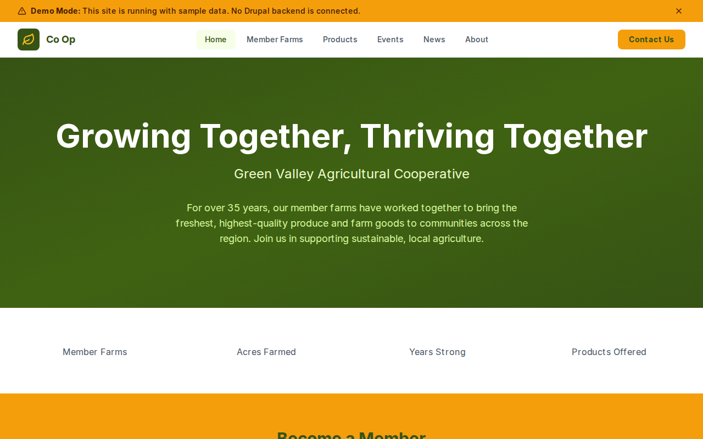

# Decoupled Co-op

An agricultural cooperative website starter template for Decoupled Drupal + Next.js. Built for farming co-ops, food cooperatives, and agricultural organizations.



## Features

- **Member Farms** - Showcase member farm profiles with specialties, certifications, and farmer stories
- **Product Catalog** - Display farm products with pricing, seasonality, origin farms, and organic status
- **Events Calendar** - Farmers markets, workshops, festivals, and community gatherings
- **News & Announcements** - Co-op news, seasonal updates, and member achievements
- **Modern Design** - Clean, accessible UI optimized for agricultural cooperative content

## Quick Start

### 1. Clone the template

```bash
npx degit nextagencyio/decoupled-co-op my-co-op
cd my-co-op
npm install
```

### 2. Run interactive setup

```bash
npm run setup
```

This interactive script will:
- Authenticate with Decoupled.io (opens browser)
- Create a new Drupal space
- Wait for provisioning (~90 seconds)
- Configure your `.env.local` file
- Import sample content

### 3. Start development

```bash
npm run dev
```

Visit [http://localhost:3000](http://localhost:3000)

---

## Manual Setup

<details>
<summary>Click to expand manual setup steps</summary>

### Authenticate with Decoupled.io

```bash
npx decoupled-cli@latest auth login
```

### Create a Drupal space

```bash
npx decoupled-cli@latest spaces create "My Co-op"
```

Note the space ID returned. Wait ~90 seconds for provisioning.

### Configure environment

```bash
npx decoupled-cli@latest spaces env 1234 --write .env.local
```

### Import content

```bash
npm run setup-content
```

This imports:
- Homepage with hero, statistics, and CTAs
- 3 Member Farms (vegetable, dairy, apiary)
- 3 Products (tomatoes, cheese, honey)
- 3 Events (farmers market, workshop, harvest festival)
- 3 News Articles (organic certification, distribution hub, youth program)
- 2 Static Pages (About, Membership)

</details>

## Content Types

### Member Farm
- **title**: Farm name
- **body**: Farm story and practices
- **farm_image**: Featured farm photo
- **farmer_name**: Farmer/owner name
- **location**: Farm location
- **acreage**: Farm size
- **specialties**: Products and specialties
- **member_since**: Year joined the co-op
- **certifications**: Organic, animal welfare, etc.

### Product
- **title**: Product name
- **body**: Product description
- **product_image**: Product photo
- **price_per_unit**: Price
- **unit_type**: Pricing unit (per pound, per jar, etc.)
- **season**: Availability season
- **origin_farm**: Source farm
- **organic**: Organic certification status
- **category**: Product category (vegetables, dairy, honey, etc.)

### Event
- **title**: Event name
- **body**: Event details and schedule
- **event_image**: Event photo
- **event_date**: Date and time
- **location**: Venue
- **event_type**: Type (farmers market, workshop, festival)
- **admission**: Entry cost

### News
- **title**: Article headline
- **body**: Article content
- **news_image**: Featured image
- **author_name**: Author
- **tags**: Topic tags

## Customization

### Colors & Branding
Edit `tailwind.config.js` to customize colors, fonts, and spacing.

### Content Structure
Modify `data/co-op-content.json` to add or change content types and sample content.

### Components
React components are in `app/components/`. Update them to match your design needs.

## Demo Mode

Demo mode allows you to showcase the application without connecting to a Drupal backend.

### Enable Demo Mode

```bash
NEXT_PUBLIC_DEMO_MODE=true
```

### Removing Demo Mode

1. Delete `lib/demo-mode.ts`
2. Delete `data/mock/` directory
3. Delete `app/components/DemoModeBanner.tsx`
4. Remove `DemoModeBanner` from `app/layout.tsx`
5. Remove demo mode checks from `app/api/graphql/route.ts`

## Deployment

### Vercel (Recommended)
[](https://vercel.com/new/clone?repository-url=https://github.com/nextagencyio/decoupled-co-op)

### Other Platforms
Works with any Node.js hosting platform that supports Next.js.

## Documentation

- [Decoupled.io Docs](https://www.decoupled.io/docs)
- [Next.js Documentation](https://nextjs.org/docs)
- [Drupal GraphQL](https://www.decoupled.io/docs/graphql)

## License

MIT
